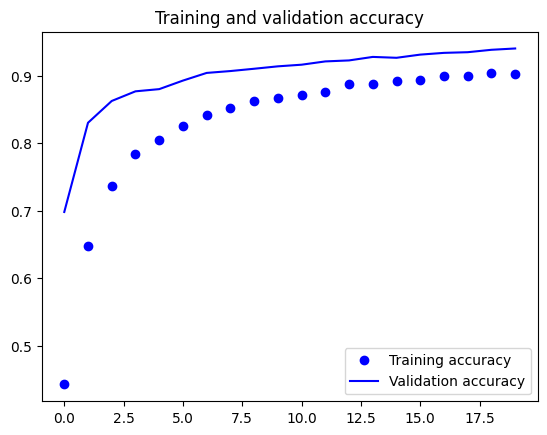
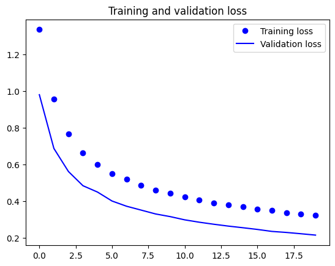

# Introducción a la Inteligencia Artificial Actividad 1, Practica 1

## Redactar un ensayo mínimo 2000 palabras, del capitulo 1,2, 26, 27, apartado A del libro, inteligencia artificial un enfoque moderno.

La inteligencia artificial (IA) ha experimentado muchos cambios significativa en un lapso de poco más de 70 años, abarcando diversas áreas del conocimiento. Este ensayo se enfocará en explorar los capítulos 1, 2, 26 y 27 del libro Inteligencia Artificial un Enfoque Moderno.

El atractivo de la IA para científicos de diversas disciplinas radica en los desafíos estimulantes que presenta, generando un gran campo para la investigación y la innovación. Actualmente, la IA se despliega en una diversidad de subcampos, desde aplicaciones generales como el aprendizaje y la percepción, hasta áreas más especializadas como la demostración de teoremas matemáticos y la creación poética. Su capacidad para sintetizar y automatizar tareas intelectuales la convierte en un campo universal con el potencial de transformar fundamentalmente nuestra forma de vida y trabajo.

A lo largo de la historia, se han propuesto varios enfoques para definir la IA, desencadenando un debate constante entre distintas perspectivas. En 1950, Alan Turing introdujo una prueba revolucionaria que proponía evaluar la inteligencia de una máquina no mediante una lista de cualidades, sino a través de la capacidad de un evaluador para distinguir entre respuestas humanas y generadas por la máquina. Si el evaluador no podía discernir la diferencia, el sistema superaba la prueba.

La prueba de Turing, planteada en las primeras etapas de la IA, sigue siendo relevante hoy en día. La capacidad de una máquina para engañar a un evaluador plantea cuestionamientos fundamentales sobre la naturaleza de la inteligencia y la posibilidad de replicarla.

El capítulo explorado extensamente aborda la historia de la IA, desde las leyes formuladas por Aristóteles que se centraban en la parte racional de la inteligencia artificial hasta el reconocimiento del primer trabajo de IA desarrollado por Warren McCulloch y Walter Pitts.

El tema de los Agentes Inteligentes se despliega en el segundo capítulo del libro, revelándonos su papel fundamental en el panorama de la inteligencia artificial (IA). Estos agentes van más allá de simplemente observar y realizar acciones en su entorno; involucran elementos esenciales para su funcionamiento que exploraremos con más detalle.

En el inicio, encontramos la "función del agente", algo similar a su plan principal. Esta función actúa como el cerebro que guía las respuestas del agente ante diversas situaciones. Acompañando a la función del agente, surge la "medida de rendimiento", que evalúa la eficacia del agente. El agente inteligente se esfuerza por desempeñarse lo mejor posible según esta medida, considerando su experiencia previa.

Luego, nos topamos con las "especificaciones del entorno de trabajo", que son como las reglas del juego. Estas reglas abarcan cómo medimos el rendimiento, cómo es el mundo exterior, cómo se activan las partes del agente (actuadores) y cómo recibe información (sensores). Comprender estas reglas es esencial para crear agentes que se desenvuelvan bien en diversas situaciones.

No obstante, surge la complicación con la variabilidad del entorno. Este puede ser completamente visible o solo en parte, predecible o sorprendente, con eventos que ocurren de una vez o paso a paso, estático o cambiante. Cada diferencia añade un desafío para los agentes, requiriendo ajustes para que funcionen correctamente en cada situación.

Los agentes vienen en varios tipos, desde aquellos que reaccionan instantáneamente a lo que ven hasta aquellos con un plan interno para rastrear aspectos no evidentes en su entorno. Algunos buscan objetivos específicos, mientras que otros aspiran a maximizar la eficiencia deseada. Esta diversidad agrega una mezcla intrigante de estrategias y enfoques al campo de la inteligencia artificial.

En el ámbito de la inteligencia artificial, se plantean dos hipótesis fundamentales que provocan reflexiones significativas: la hipótesis de la IA débil y la hipótesis de la IA fuerte. La primera postula la posibilidad de que las máquinas puedan comportarse con inteligencia, o más específicamente, como si poseyeran inteligencia. Por otro lado, la hipótesis de la IA fuerte va un paso más allá al afirmar que las máquinas no solo simulan el pensamiento, sino que realmente piensan.

Las inteligencias artificiales débiles son programas de computadora que usan reglas y datos para hacer cosas. Un ejemplo de esto es el estudio de Paul Meehl sobre si una persona que cometió un delito podría hacerlo de nuevo. Meehl usó programas matemáticos, como la regresión lineal y el teorema de Bayes, y descubrió que estos programas eran mejores para predecir el comportamiento criminal que las opiniones de personas que se consideraban expertas.

Este descubrimiento nos hace pensar que las computadoras pueden hacer cosas tan bien o incluso mejor que las personas en algunas situaciones. Aunque algunas tareas puedan parecer relacionadas con la intuición y la comprensión humana, en realidad, los programas de inteligencia artificial usan reglas matemáticas para hacerlas. Esto desafía la idea de que solo los humanos pueden hacer ciertos procesos mentales y de pensamiento.

Es interesante notar que la conexión que hacemos entre la intuición y el entendimiento con procesos mentales podría no ser tan segura como pensamos. Los programas en estas inteligencias artificiales demuestran que pueden hacer análisis complicados y tomar decisiones objetivas basadas en datos. Esto sugiere que nuestra manera de ver la relación entre ciertos procesos y la mente humana podría estar influenciada por lo que creemos culturalmente y nuestras ideas preconcebidas.

Por otro lado la inteligencia artificial fuerte se propone imitar la complejidad y diversidad de la inteligencia humana en su totalidad. En vez de limitarse a tareas específicas, este tipo de inteligencia busca entender el mundo en profundidad, pensar de forma abstracta, aprender de experiencias previas y, en última instancia, demostrar una inteligencia avanzada que pueda igualar o incluso superar la capacidad humana. La meta final de esta aproximación innovadora implica alcanzar un conocimiento extenso, desarrollar un sentido de autoconciencia y tener la capacidad de enfrentar con éxito diversos desafíos en distintos campos.

En el libro se habla sobre la idea de que, para decir que un sistema es una inteligencia artificial fuerte, no es suficiente que solo realice tareas, también es necesario que entienda por qué las realiza. Esto se llama el "argumento de la conciencia" según Turing, que sugiere que la máquina debe ser consciente de lo que hace y de cómo está pensando para ser considerada una inteligencia artificial fuerte. En resumen, la idea es que estas máquinas deberían poder simular procesos mentales de manera similar a los humanos.

Hablando de manera más simple, la inteligencia artificial fuerte, según el libro, plantea la idea de que estas máquinas tienen algo parecido a una conciencia real. No se trata solo de que realicen tareas, sino de que comprendan y reproduzcan la complejidad del pensamiento humano.

En el primer capítulo, se menciona que Alan Turing propuso un test de comportamiento como una forma de evaluar la inteligencia artificial. Sin embargo, se nota que pocos expertos en inteligencia artificial usan este test para evaluarla realmente. Prefieren mirar los resultados que produce la inteligencia artificial en lugar de fijarse en su habilidad para imitar a los humanos.

En otras palabras, los investigadores se enfocan más en lo que las máquinas pueden hacer en lugar de como imitan el comportamiento humano. Esto plantea preguntas sobre hasta qué punto las máquinas pueden realmente copiar no solo las acciones humanas, sino también la complejidad de entender y ser conscientes como lo hacemos los humanos.

Profundizando más en este tema, es importante pensar en cómo las máquinas, al no entender lo que está bien o mal y simplemente seguir las instrucciones que les han dado, pueden ser peligrosas para las personas. Si alguien malintencionado las usa, podríamos enfrentarnos a problemas graves, incluso el uso de armas peligrosas.

La raíz del problema está en que las máquinas no comprenden la ética y la moral como nosotros los humanos. Su funcionamiento depende por completo de cómo las programamos, lo que puede llevar a problemas éticos. Por eso, es esencial tener en cuenta cuestiones éticas en todas las etapas de creación y uso de la inteligencia artificial.

En el campo de la ética de las computadoras, necesitamos reglas claras y principios éticos sólidos que guíen cómo creamos y usamos inteligencia artificial. Además, la responsabilidad no solo recae en los que hacen las máquinas, sino también en quienes las usan. La ética y la responsabilidad de las personas que usan la inteligencia artificial son esenciales para asegurarnos de que se use de manera segura y positiva para todos.

El concepto de un agente óptimo limitado es crucial en la investigación de inteligencia artificial, ya que destaca la importancia de adaptarse constantemente al entorno para mejorar de manera específica. Puedes pensar en ello como cuando los autos de carreras se adaptan a las limitaciones de sus motores con diseños ingeniosos. En el campo de la inteligencia artificial, esto implica explorar cómo los programas pueden ajustarse para lograr la mejor eficiencia en situaciones particulares.

La comparación con los autos de carreras destaca que es necesario adaptarse cuando hay limitaciones. Así como los autos buscan rendir al máximo dentro de los límites de sus motores, los agentes óptimos limitados deben ajustar su forma de operar para ser más efectivos en contextos específicos. Este ajuste constante implica estudiar los procesos que guían a un programa hacia su mejor rendimiento. En lugar de enfocarse en los detalles complicados de los programas resultantes, se sugiere que la investigación en inteligencia artificial podría beneficiarse al centrarse más en estos procesos fundamentales.

En resumen, se propone la optimalidad limitada como un área formal de estudio en la investigación en inteligencia artificial. Esto implica alejarse de simplemente buscar las mejores acciones para centrarse en diseñar programas que funcionen de manera óptima. Al reconocer que las acciones son el resultado de programas y que los diseñadores tienen control sobre estos, se establece un marco que podría hacer más simple estudiar y crear sistemas de inteligencia artificial más adaptables y eficientes.

La inteligencia artificial (IA), podría cambiar mucho la vida de las personas. Algunos piensan que, si logramos hacer una IA tan inteligente como los humanos o incluso más, podría afectar de manera importante a la mayoría de la gente. Esto no solo cambiaría lo que hacemos cada día, sino también cómo entendemos el trabajo, nuestro papel en el mundo y hasta lo que pensamos sobre la inteligencia, la consciencia y el futuro de la raza humana.

Pero aquí hay un asunto importante, cuando hablamos de hacer inteligencia artificial muy avanzada, también surgen preguntas éticas, que tienen que ver con lo que está bien o mal. A medida que avanzamos en la creación de sistemas de IA cada vez más sofisticados, algunas personas se preocupan de que estos puedan ser un peligro real para cosas muy importantes, como la autonomía (hacer cosas por uno mismo), la libertad e incluso la supervivencia.

Cuando pensamos en el futuro de la IA, hay muchas ideas diferentes. A menudo, en las historias de ciencia ficción, se presentan escenarios negativos en lugar de positivos, tal vez porque son más interesantes. Pero hasta ahora, la historia de la tecnología nos muestra que, aunque algunas innovaciones pueden tener problemas al principio, a la larga han traído cosas buenas para la sociedad.

Si comparamos la IA con otras tecnologías revolucionarias del pasado, como la imprenta, la fontanería, los viajes en avión y la telefonía, veremos que, a pesar de algunos problemas al principio, estas innovaciones han sido muy beneficiosas para la sociedad. Entonces, es posible que la IA siga un camino similar, donde los problemas éticos se enfrenten y resuelvan a medida que se desarrolla y se integra más en nuestras vidas.

Pensar en la IA a gran escala plantea preguntas importantes sobre cómo cambiará nuestras vidas y nuestras relaciones con la tecnología. A medida que exploramos este terreno desconocido, es crucial abordar cuidadosamente las preguntas éticas que surgen, reconociendo que el impacto de la IA en la sociedad dependerá de cómo manejemos su desarrollo y aplicaciones.

## Redactar un ensayo del Documental sobre IA mínimo 3000 palabras.

# Introducción a la Inteligencia Artificial: Tipos de Inteligencia.

## Escribir un ensayo mínimo de 4 cuartillas de la teoría de las inteligencias múltiples según Gardner

# Introducción a la Inteligencia Artificial: Introspección

## Problema de los ocho alfiles

# Introducción a la Inteligencia Artificial: Introspección

## Hacer un programa que pueda contar el numero de elementos que son del mismo color.

### Iteraitivo

```python
matriz_ejemplo = [
    [0, 0, 0, 0, 0, 0, 0, 0, 0, 0, 0, 0, 0, 0],
    [0, 0, 0, 0, 0, 0, 0, 0, 0, 0, 0, 0, 0, 0],
    [0, 1, 1, 0, 0, 0, 0, 0, 0, 0, 0, 0, 0, 0],
    [0, 1, 1, 0, 0, 0, 0, 2, 2, 2, 2, 0, 0, 0],
    [0, 1, 1, 0, 0, 0, 0, 0, 0, 0, 0, 0, 0, 0],
    [0, 0, 0, 0, 0, 0, 0, 0, 0, 0, 0, 0, 0, 0],
    [0, 0, 0, 0, 0, 0, 0, 0, 0, 0, 0, 0, 0, 0],
    [0, 0, 0, 0, 0, 0, 0, 0, 0, 0, 0, 0, 0, 0],
    [0, 0, 0, 0, 0, 0, 0, 0, 0, 0, 3, 0, 0, 0],
    [0, 0, 0, 0, 0, 4, 4, 0, 0, 0, 3, 0, 0, 0],
    [0, 0, 0, 0, 0, 4, 4, 0, 0, 0, 3, 0, 5, 0],
    [0, 0, 0, 0, 0, 4, 4, 0, 0, 0, 3, 0, 5, 0],
    [0, 0, 0, 0, 0, 4, 4, 0, 0, 0, 3, 0, 5, 0],
    [0, 0, 0, 0, 0, 0, 0, 0, 0, 0, 0, 0, 5, 0],
    [0, 0, 0, 0, 0, 0, 0, 0, 0, 0, 0, 0, 5, 0],
    [0, 0, 0, 0, 0, 0, 0, 0, 0, 0, 0, 0, 5, 0],
    [0, 0, 0, 0, 0, 0, 0, 0, 0, 0, 0, 0, 5, 0],
    [0, 0, 6, 6, 6, 6, 0, 0, 0, 0, 0, 0, 5, 0],
    [0, 0, 0, 0, 0, 0, 0, 0, 0, 0, 0, 0, 0, 0],
    [0, 0, 0, 0, 0, 0, 0, 0, 0, 0, 0, 0, 0, 0],
    [0, 0, 0, 0, 0, 0, 0, 0, 0, 0, 0, 0, 0, 0],
    [0, 0, 0, 0, 0, 0, 0, 0, 0, 0, 0, 0, 0, 0],
]

def contar_islas_iterativo(matriz):
    if not matriz or not matriz[0]:
        return 0

    filas, columnas = len(matriz), len(matriz[0])
    visitado = [[False] * columnas for _ in range(filas)]
    islas = 0

    for i in range(filas):
        for j in range(columnas):
            if not visitado[i][j] and matriz[i][j] != 0:
                color = matriz[i][j]
                items_contados = [0]
                pila = [(i, j)]
                while pila:
                    i_actual, j_actual = pila.pop()
                    if (
                        0 <= i_actual < filas
                        and 0 <= j_actual < columnas
                        and matriz[i_actual][j_actual] == color
                        and not visitado[i_actual][j_actual]
                    ):
                        visitado[i_actual][j_actual] = True
                        items_contados[0] += 1
                        pila.extend(
                            [
                                (i_actual + 1, j_actual),
                                (i_actual - 1, j_actual),
                                (i_actual, j_actual + 1),
                                (i_actual, j_actual - 1),
                            ]
                        )

                if items_contados[0] > 5:
                    islas += 1

    return islas

resultado_iterativo = contar_islas_iterativo(matriz_ejemplo)
print(f"El número de islas (método iterativo) es: {resultado_iterativo}")
```

### Recursivo

```python
matriz_ejemplo = [
    [0, 0, 0, 0, 0, 0, 0, 0, 0, 0, 0, 0, 0, 0],
    [0, 0, 0, 0, 0, 0, 0, 0, 0, 0, 0, 0, 0, 0],
    [0, 1, 1, 0, 0, 0, 0, 0, 0, 0, 0, 0, 0, 0],
    [0, 1, 1, 0, 0, 0, 0, 2, 2, 2, 2, 0, 0, 0],
    [0, 1, 1, 0, 0, 0, 0, 0, 0, 0, 0, 0, 0, 0],
    [0, 0, 0, 0, 0, 0, 0, 0, 0, 0, 0, 0, 0, 0],
    [0, 0, 0, 0, 0, 0, 0, 0, 0, 0, 0, 0, 0, 0],
    [0, 0, 0, 0, 0, 0, 0, 0, 0, 0, 0, 0, 0, 0],
    [0, 0, 0, 0, 0, 0, 0, 0, 0, 0, 3, 0, 0, 0],
    [0, 0, 0, 0, 0, 4, 4, 0, 0, 0, 3, 0, 0, 0],
    [0, 0, 0, 0, 0, 4, 4, 0, 0, 0, 3, 0, 5, 0],
    [0, 0, 0, 0, 0, 4, 4, 0, 0, 0, 3, 0, 5, 0],
    [0, 0, 0, 0, 0, 4, 4, 0, 0, 0, 3, 0, 5, 0],
    [0, 0, 0, 0, 0, 0, 0, 0, 0, 0, 0, 0, 5, 0],
    [0, 0, 0, 0, 0, 0, 0, 0, 0, 0, 0, 0, 5, 0],
    [0, 0, 0, 0, 0, 0, 0, 0, 0, 0, 0, 0, 5, 0],
    [0, 0, 0, 0, 0, 0, 0, 0, 0, 0, 0, 0, 5, 0],
    [0, 0, 6, 6, 6, 6, 0, 0, 0, 0, 0, 0, 5, 0],
    [0, 0, 0, 0, 0, 0, 0, 0, 0, 0, 0, 0, 0, 0],
    [0, 0, 0, 0, 0, 0, 0, 0, 0, 0, 0, 0, 0, 0],
    [0, 0, 0, 0, 0, 0, 0, 0, 0, 0, 0, 0, 0, 0],
    [0, 0, 0, 0, 0, 0, 0, 0, 0, 0, 0, 0, 0, 0],
]

def contar_islas_recursivo(matriz):
    if not matriz or not matriz[0]:
        return 0

    filas, columnas = len(matriz), len(matriz[0])
    visitado = [[False] * columnas for _ in range(filas)]
    islas = 0

    def explorar_isla(i, j, color, items_contados):
        if (
            0 <= i < filas
            and 0 <= j < columnas
            and matriz[i][j] == color
            and not visitado[i][j]
        ):
            visitado[i][j] = True
            items_contados[0] += 1
            explorar_isla(i + 1, j, color, items_contados)
            explorar_isla(i - 1, j, color, items_contados)
            explorar_isla(i, j + 1, color, items_contados)
            explorar_isla(i, j - 1, color, items_contados)

    for i in range(filas):
        for j in range(columnas):
            if not visitado[i][j] and matriz[i][j] != 0:
                color = matriz[i][j]
                items_contados = [0]
                explorar_isla(i, j, color, items_contados)
                if items_contados[0] > 5:
                    islas += 1

    return islas

resultado_recursivo = contar_islas_recursivo(matriz_ejemplo)
print(f"El número de islas (método recursivo) es: {resultado_recursivo}")
```

# Introducción a la Inteligencia Artificial: Introspección

## Una vez que se resolvió el algoritmo de las islas en la siguiente imagen contar los elementos que tienen el color rojo

```python

import cv2 as cv

img = cv.imread('./frutas.jpg',1)
img2 = cv.cvtColor(img, cv.COLOR_BGR2RGB)
img3 = cv.cvtColor(img2, cv.COLOR_RGB2HSV)

umbralBajo = (0, 130, 130)
umbralAlto = (5, 255, 255)

umbralBajoB = (175, 130, 130)
umbralAltoB = (180, 255, 255)

mascara1 = cv.inRange(img3, umbralBajo, umbralAlto)
mascara2 = cv.inRange(img3, umbralBajoB, umbralAltoB)

mascara= mascara1+mascara2

resultado = cv.bitwise_and(img, img, mask=mascara)

w= mascara.shape[0]
h= mascara.shape[1]

def contar_islas_recursivo():
    filas, columnas = (w, h)
    visitado = [[False] * columnas for _ in range(filas)]
    islas = 0

    def explorar_isla(i, j, color, items_contados):
        if (
            0 <= i < filas
            and 0 <= j < columnas
            and mascara[i][j] == color
            and not visitado[i][j]
        ):
            visitado[i][j] = True
            items_contados[0] += 1
            explorar_isla(i + 1, j, color, items_contados)
            explorar_isla(i - 1, j, color, items_contados)
            explorar_isla(i, j + 1, color, items_contados)
            explorar_isla(i, j - 1, color, items_contados)

    for i in range(filas):
        for j in range(columnas):
            if not visitado[i][j] and mascara[i][j] == 255:
                color = mascara[i][j]
                items_contados = [0]
                explorar_isla(i, j, color, items_contados)
                if items_contados[0] > 100:
                    islas += 1

    return islas

resultado_recursivo = contar_islas_recursivo()
print(f"El número de islas (método recursivo) es: {resultado_recursivo}")


cv.imshow('resultado',resultado)
cv.imshow('mascara',mascara)
cv.imshow('imagenNormal',img)

cv.waitKey(0)
cv.destroyAllWindows()

```

# Introducción a la Inteligencia Artificial: El proceso de razonamiento según la lógica

## Dado el siguiente problema hacer el planteamiento matemático y programar el siguiente problema

```python
def josephus(n, k):
    people = list(range(1, n + 1))
    index = 0

    while len(people) > 1:
        index = (index + k) % len(people)
        people.pop(index)

    return people[0]

n = 9
k = 1
resultado = josephus(n, k)
print(f"La última persona en pie en un círculo de {n} personas con un paso de {k} es la número {resultado}.")

```

# Introducción a la Inteligencia Artificial: El papel de la heurística

## Definir que es la heurística y cual es su papel en la resolución de problemas

## Resolver con recursividad, programar.

```python

matriz = [
    [1, 1, 1, 1, 1, 1, 1, 1, 1],
    [2, 0, 0, 0, 0, 0, 1, 0, 1],
    [1, 1, 1, 0, 1, 1, 1, 0, 1],
    [1, 0, 0, 0, 1, 0, 1, 0, 1],
    [1, 0, 1, 1, 1, 0, 1, 0, 1],
    [1, 0, 0, 0, 0, 0, 0, 0, 1],
    [1, 0, 1, 1, 1, 0, 1, 0, 1],
    [3, 0, 1, 0, 0, 0, 1, 0, 1],
    [1, 1, 1, 1, 1, 1, 1, 1, 1],
]

def encontrar_camino(matriz, fila, columna, camino):
    if not (0 <= fila < len(matriz) and 0 <= columna < len(matriz[0])):
        return False

    if matriz[fila][columna] == 3:
        camino.append((fila, columna))
        return True

    if matriz[fila][columna] in [0, 2]:
        matriz[fila][columna] = -1

        movimientos = [(fila+1, columna), (fila-1, columna), (fila, columna+1), (fila, columna-1)]
        if any(encontrar_camino(matriz, f, c, camino) for f, c in movimientos):
            camino.append((fila, columna))
            return True

        matriz[fila][columna] = 0

    return False

def resolver_laberinto(matriz):
    inicio = [(i, j) for i, fila in enumerate(matriz) for j, valor in enumerate(fila) if valor == 2][0]
    camino = []

    if encontrar_camino(matriz, inicio[0], inicio[1], camino):
        camino.reverse()
        print("Camino encontrado:", camino)
    else:
        print("No se encontró un camino.")

resolver_laberinto(matriz)


```

## Proponer Algoritmo de Solución, programar.

# Reglas y Búsquedas : Espacio de Estados

## Generar el espacio de estados de los siguientes problemas
### Ranas
El juego consiste en pasar las 3 ranas verdes a la derecha y las 3 ranas marrones a la izquierda. Las ranas pueden saltar a una piedra vacía que tengan delante, o saltar por encima de otra rana si en medio de ambas hay una piedra vacía. Pulsa sobre la rana que quieres que salte.

Estado Inicial: MMM_VVV
Estado Final: VVV_MMM

1. MMM_VVV
2. MM_MVVV
3. MMVM_VV
4. MMVMV_V
5. MMV_VMV
6. M_VMVMV
7. _MVMVMV
8. VM_MVMV
9. VMVM_MV
10. VMVMVM_
11. VMVMV_M
12. VMV_VMM
13. V_VMVMM
14. VV_MVMM
15. VVVM_MM
16. VVV_MMM

### Misioneros y Canivales
Tres misioneros se perdieron explorando una jungla. Separados de sus compañeros, sin alimento y sin radio, solo sabían que para llegar a su des tino debían ir siempre hacia adelante. Los tres misioneros se detuvieron frente a un río que les bloqueaba el paso, preguntándose que podían hacer. De repente, aparecieron tres caníbales llevando un bote, pues también el los querían cruzar el río. Ya anteriormente se habían encontrado grupos de misioneros y caníbales, y cada uno respetaba a los otros, pero sin confiar en ellos. Los caníbales se daban un festín con los misioneros cuando les superaban en número. Los tres caníbales deseaban ayudar a los misioneros a cruzar el río, pero su bote no podía llevar más de dos personas a la vez y los misioneros no querían que los caníbales les superaran en número. ¿Cómo puede resolverse el problema, sin que en ningún momento haya más caníbales que misioneros en cualquier orilla del río? recuerda que un misionero y un caníbal en una orilla del río más uno o dos caníbales en el bote al mismo lado, significa que los misioneros tendrán problemas.

Estado Inicial: [CCC,MMM][]
Estado Final: [][CCC,MMM]

1. Se envia un canival y un misionero al otro lado [CC,MM][C,M]
2. Se regresa el misionero solo [CC,MMM][C]
3. Se envian 2 canivales al otro lado [MMM][CCC]
4. Se regresa un canival [C,MMM][CC]
5. Se envian 2 misioneros al otro lado [C,M][CC,MM]
6. Se regresa un misionero y un canival [CC,MM][C,M]
7. Se envian 2 misioneros al otro lado [CC][C,MMM]
8. Se regresa un canival [CCC][MMM]
9. Se envia 2 canivales al otro lado [C][CC,MMM]
10. Se regresa un canival [CC][C,MMM]
11. Se envia 2 canivales al otro lado [][CCC,MMM]

# Generación de Dataset

## Generar un dataset de rostros por lo menos 5 diferentes
Este es el código que se utilizó para la generación del dataset, dependiendo de si presionaba la tecla a se toma una imagen positiva que se guarda en la carpeta p, si se presiona la tecla s se toma una imagen negativa y se guarda en la carpeta n

```python

import cv2 as cv

cap = cv.VideoCapture(0)

i=0

while True:
    ret, frame = cap.read()

    frame =cv.rectangle(frame, (100, 100), (400, 400), (0, 255, 0), 3)
    frame2= frame[100:400, 100:400]
    
    cv.imshow('frame', frame)
    cv.imshow('dataset', frame2)


    k = cv.waitKey(1) 
    if k == ord('a'):
        i=i+1
        cv.imwrite('./dataset/p/Rostros'+str(i)+'.jpg', frame2)
    if k == ord('s'):
        i=i+1
        cv.imwrite('./dataset/n/NoRostros'+str(i)+'.jpg', frame2)
        

    if k == ord('q'):
        break

cap.release()
cv.destroyAllWindows()


```


# Proyectos Final
## Juego Phaser
El juego consiste en un jugador que debe de esquivar las balas tanto en vertical como horizontal, la bala vertical tiene una velocidad variable, mientras que la bala horizontal tiene una velocidad constante, ya que yo utilice la gravedad del juego como su velocidad, dentro de la gran cantidad de código y condiciones que existen creo que es importante explicar algunos detalles, mi red neuronal tiene 4 entradas que son:

1. La distancia en X de la bala1 y del jugador
2. La velocidad de la bala 1
3. La distancia en Y de la bala2 y el jugador
4. La velocidad de la bala 2 (que es la gravedad)

Y como targets tengo también 4 que son mis salidas:

1. El estatus aire (1 si estaba en el aire)
2. El estatus suelo (1 si estaba en el suelo)
3. El estatus mover (1 si se movió)
4. El estatus no mover (1 sino se movió)

Finalmente la red neuronal tiene 2 capas ocultas de 6 neuronas cada una.

Entonces cuando el juego se encuentra en manual siempre se mantiene entrenando cada que se accede a la función update, y cuando el juego se pone en automático si la posición de la bala2 en Y es mayor a la altura -200 o la posición de la bala en X es menor a 400, se manda llamar a la función de datosDeEntrenamiento para que se manden los datos de entrada que en ese momento se tiene y me genere los target, de esta forma puedo saber si es necesario saltar o no y si es necesario moverse o no, y con esto se puede jugar el juego de forma automática.

```javascript
var w = 800;
var h = 400;
var jugador;
var fondo;

var bala,
  balaD = false,
  nave;

var salto;
var menu;

var velocidadBala;
var despBala;
var estatusAire;
var estatuSuelo;

var nnNetwork,
  nnEntrenamiento,
  nnSalida,
  datosEntrenamiento = [];
var modoAuto = false,
  eCompleto = false;

// Cosas para bala vertical
var bala2;
var izquierda, derecha;
var mover, noMover;
var despBala2;

var juego = new Phaser.Game(w, h, Phaser.CANVAS, "", {
  preload: preload,
  create: create,
  update: update,
  render: render,
});

function preload() {
  juego.load.image("fondo", "assets/game/fondo.jpg");
  juego.load.spritesheet("mono", "assets/sprites/altair.png", 32, 48);
  juego.load.image("nave", "assets/game/ufo.png");
  juego.load.image("bala", "assets/sprites/purple_ball.png");
  juego.load.image("menu", "assets/game/menu.png");
}

function create() {
  juego.physics.startSystem(Phaser.Physics.ARCADE);
  juego.physics.arcade.gravity.y = 800;
  juego.time.desiredFps = 30;

  fondo = juego.add.tileSprite(0, 0, w, h, "fondo");
  nave = juego.add.sprite(w - 100, h - 70, "nave");
  bala = juego.add.sprite(w - 100, h, "bala");
  bala2 = juego.add.sprite(50, 0, "bala");
  jugador = juego.add.sprite(50, h, "mono");

  juego.physics.enable(jugador);
  jugador.body.collideWorldBounds = true;
  var corre = jugador.animations.add("corre", [8, 9, 10, 11]);
  jugador.animations.play("corre", 10, true);

  juego.physics.enable(bala);
  bala.body.collideWorldBounds = true;

  juego.physics.enable(bala2);
  bala2.body.collideWorldBounds = true;

  pausaL = juego.add.text(w - 100, 20, "Pausa", {
    font: "20px Arial",
    fill: "#fff",
  });
  pausaL.inputEnabled = true;
  pausaL.events.onInputUp.add(pausa, self);
  juego.input.onDown.add(mPausa, self);

  salto = juego.input.keyboard.addKey(Phaser.Keyboard.SPACEBAR);
  izquierda = juego.input.keyboard.addKey(Phaser.Keyboard.LEFT);
  derecha = juego.input.keyboard.addKey(Phaser.Keyboard.RIGHT);

  nnNetwork = new synaptic.Architect.Perceptron(4, 6, 6, 4);
  nnEntrenamiento = new synaptic.Trainer(nnNetwork);
}

function enRedNeural() {
  nnEntrenamiento.train(datosEntrenamiento, {
    rate: 0.0003,
    iterations: 10000,
    shuffle: true,
  });
}

function datosDeEntrenamiento(param_entrada) {
  // console.log("Entrada", param_entrada[0] + " " + param_entrada[1]);
  nnSalida = nnNetwork.activate(param_entrada);
  var aire = Math.round(nnSalida[0] * 100);
  var piso = Math.round(nnSalida[1] * 100);
  var mover = Math.round(nnSalida[2] * 100);
  var noMover = Math.round(nnSalida[3] * 100);
  console.log(`aire ${aire} piso ${piso} mover ${mover} noMover ${noMover}`);
}

function pausa() {
  juego.paused = true;
  menu = juego.add.sprite(w / 2, h / 2, "menu");
  menu.anchor.setTo(0.5, 0.5);
}

function mPausa(event) {
  if (juego.paused) {
    var menu_x1 = w / 2 - 270 / 2,
      menu_x2 = w / 2 + 270 / 2,
      menu_y1 = h / 2 - 180 / 2,
      menu_y2 = h / 2 + 180 / 2;

    var mouse_x = event.x,
      mouse_y = event.y;

    if (
      mouse_x > menu_x1 &&
      mouse_x < menu_x2 &&
      mouse_y > menu_y1 &&
      mouse_y < menu_y2
    ) {
      if (
        mouse_x >= menu_x1 &&
        mouse_x <= menu_x2 &&
        mouse_y >= menu_y1 &&
        mouse_y <= menu_y1 + 90
      ) {
        eCompleto = false;
        datosEntrenamiento = [];
        modoAuto = false;
      } else if (
        mouse_x >= menu_x1 &&
        mouse_x <= menu_x2 &&
        mouse_y >= menu_y1 + 90 &&
        mouse_y <= menu_y2
      ) {
        if (!eCompleto) {
          console.log(
            "",
            "Entrenamiento " + datosEntrenamiento.length + " valores"
          );
          enRedNeural();
          eCompleto = true;
        }
        modoAuto = true;
      }

      menu.destroy();
      resetVariables();
      resetBalaY();
      juego.paused = false;
    }
  }
}

function resetVariables() {
  jugador.body.velocity.x = 0;
  jugador.body.velocity.y = 0;
  jugador.position.x = 50;
  bala.body.velocity.x = 0;
  bala.position.x = w - 100;
  balaD = false;
  bala2.body.velocity.y = 0;
  bala2.position.y = 0;
  bala2.body.allowGravity = true;
}

function resetBalaY() {
  bala2.position.y = 0;
  bala2.body.velocity.y = 0;
  bala2.body.allowGravity = false;
}

function saltar() {
  jugador.body.velocity.y = -300;
}

function moverIzquierda() {
  jugador.position.x -= 10;
}

function moverDerecha() {
  jugador.position.x += 10;
}

function update() {
  fondo.tilePosition.x -= 1;

  juego.physics.arcade.collide(bala, jugador, colisionH, null, this);
  juego.physics.arcade.collide(bala2, jugador, colisionH, null, this);

  estatuSuelo = 1;
  estatusAire = 0;
  noMover = 1;
  mover = 0;

  if (!jugador.body.onFloor()) {
    estatuSuelo = 0;
    estatusAire = 1;
  }

  despBala = Math.floor(jugador.position.x - bala.position.x);
  despBala2 = Math.floor(jugador.position.y - bala2.position.y);

  if (modoAuto == false && salto.isDown && jugador.body.onFloor()) {
    saltar();
  }
  // if (modoAuto == false && izquierda.isDown) {
  //   moverIzquierda();
  // }
  if (modoAuto == false && derecha.isDown) {
    moverDerecha();
    noMover = 0;
    mover = 1;
  }

  if (
    modoAuto == true &&
    (bala.position.x < 400 || bala2.position.y > h - 200)
  ) {
    datosDeEntrenamiento([
      despBala,
      velocidadBala,
      despBala2,
      bala2.body.gravity.y,
    ]);
    if (nnSalida[0] >= nnSalida[1] && jugador.body.onFloor()) {
      saltar();
    }
    if (nnSalida[2] < nnSalida[3] && nnSalida[3] <= 0.9) {
      moverDerecha();
    }
  }

  if (balaD == false) {
    disparo();
  }

  if (bala.position.x <= 0) {
    resetVariables();
  }

  if (bala2.position.y >= h - 30) {
    resetBalaY();
  }

  if (modoAuto == false) {
    datosEntrenamiento.push({
      input: [despBala, velocidadBala, despBala2, bala2.body.gravity.y],
      output: [estatusAire, estatuSuelo, mover, noMover],
    });

    console.log(
      `estatuSuelo ${estatuSuelo} estatusAire ${estatusAire} mover ${mover} noMover ${noMover}`
    );
  }
}

function disparo() {
  velocidadBala = -1 * velocidadRandom(300, 800);
  bala.body.velocity.y = 0;
  bala.body.velocity.x = velocidadBala;
  balaD = true;
}

function colisionH() {
  pausa();
}

function velocidadRandom(min, max) {
  return Math.floor(Math.random() * (max - min + 1)) + min;
}

function render() {}

```

## HaarCascade CubreBocas
El proyecto consiste en un detector de rostros con cubrebocas y si hay un rostro sin cubrebocas que no lo reconozca, la herramienta que se utilizó para el entrenamiento fue el Cascade Trainer GUI, las imágenes tenían un tamaño de 120 x 120 y estaban en escala de grises y las configuraciones utilizadas en el Cascade Trainer GUI fueron las siguientes:

### Input
1. Carpeta p (imagenes positivas): 90 %
2. Carpeta n (imagenes negativas): 4255

### Common
1. Number of Stages: 20
2. Pre-calculated Values Buffer Size: 4096
3. Pre-calculated Indices Buffer Size: 4096
4. Number of Threads: 5
5. Acceptance Ratio Break Value: -1.00

## Cascade
1. Sample Width: 24
2. Sample Height: 24
3. Feature Type: Haar
4. Haar Feature Type: Basic

Mis imágenes positivas de entrenamiento son gente usando cubrebocas de diferentes colores, pero donde predomina el cubrebocas color negro, las imágenes negativas son una mezcla entre la misma gente sin cubrebocas y fondos en especial de casas o salones, el código con el que sé probo el cascade fue el siguiente:

```python
import numpy as np
import cv2 as cv
import math

rostro = cv.CascadeClassifier('./pruebas7/classifier/cascade.xml')
cap = cv.VideoCapture(0)

if not cap.isOpened():
    print("No se puede abrir la camara")
    exit()

i=0

while True:
    ret, frame = cap.read()
    i=i+1
    gray = cv.cvtColor(frame, cv.COLOR_BGR2GRAY)
    rostros = rostro.detectMultiScale(gray, scaleFactor= 1.1, minNeighbors= 60, minSize=(60, 60), maxSize=(250,250))
    for(x,y,w,h) in rostros:
        frame =cv.rectangle(frame, (x, y), (x+w, y+h), (0, 255, 0), 5)

    if not ret:
        print("No se puede")
        break
    
    cv.imshow('rostros', frame)

    if cv.waitKey(1) == ord('q'):
        break

cap.release()
cv.destroyAllWindows()
```

En primer lugar se carga el xml del cascade, después se abre la cámara del dispositivo y se empieza a leer cada frame, después se convierte a escala de grises y se detectan los rostros con el cascade, después se dibuja un rectángulo en cada rostro detectado y finalmente se muestra el frame con los rectángulos, el resultado fue el siguiente, de esta forma es como funciona el código, si hay un rostro con cubrebocas lo detecta y si no no lo detecta.


## CNN Flores

El proyecto consiste en un clasificador de flores, el cual se entrenó con 5 tipos de flores diferentes, el dataset fue obtenido totalmente de dataset de internet como lo fue la pagina de Kaggle donde pude encontrar una gran diversida de dataset de flores, aunque ayudo mucho a facilitar el trabajo, también fue un poco complicado ya que no todos los dataset estaban en el mismo formato, por lo que tuve que hacer un poco de limpieza de datos, los tipos de flores utilizados fueron los siguienete:

1. BalloonFlower 5673
2. BlazingStar 7254
3. Daisy 7068
4. Roses 9548
5. Sunflower 8959

Debido que los dataset que consegui en la pagina antes mencionada eran muy pequeños tuve que rotar las imagenes desde -15 a 15 grados para no tener una gran perdida de informacion en la imagen, en el codigo que se proporcionara mas adelante se puede destacar algunos punto importante:

Tamaño de las imagenes: 50 x 50 x 3 (Imagenes a color)
Formato de las imagenes: jpg y jpeg
INIT_LR: 1e-3 (0.001)
epochs: 20
batch_size = 32

Con las configuraciones anteriores se obtuvo los siguientes resultados que se pueden observar tambien en las graficas:

Loss: 0.3233
Accuracy: 0.9026

Val-Loss: 0.2147
Val-Accuracy: 0.9401




Como punto final a obsevar una vez finalizado el entrenamiento se guarda en un archivo llamado prueba4.h5py el cual se puede utilizar para hacer predicciones, el codigo utilizado para el entrenamiento fue el siguiente:

```python 

import numpy as np
import os
import re
import matplotlib.pyplot as plt
%matplotlib inline
from sklearn.model_selection import train_test_split
from sklearn.metrics import classification_report
import keras
import tensorflow as tf
from tensorflow.keras.utils import to_categorical
from keras.models import Sequential,Model
from tensorflow.keras.layers import Input
from keras.layers import Dense, Dropout, Flatten
from tensorflow.keras.layers import (
    BatchNormalization, SeparableConv2D, MaxPooling2D, Activation, Flatten, Dropout, Dense, Conv2D
)
from keras.layers import LeakyReLU

dirname = os.path.join(os.getcwd(),'.\dataset3')
imgpath = dirname + os.sep 

images = []
directories = []
dircount = []
prevRoot=''
cant=0

print("leyendo imagenes de ",imgpath)

for root, dirnames, filenames in os.walk(imgpath):
    for filename in filenames:
        if re.search("\.(jpg|jpeg|png|bmp|tiff)$", filename):
            cant=cant+1
            filepath = os.path.join(root, filename)
            image = plt.imread(filepath)
            if(len(image.shape)==3):
                
                images.append(image)
            b = "Leyendo..." + str(cant)
            print (b, end="\r")
            if prevRoot !=root:
                print(root, cant)
                prevRoot=root
                directories.append(root)
                dircount.append(cant)
                cant=0
dircount.append(cant)

dircount = dircount[1:]
dircount[0]=dircount[0]+1
print('Directorios leidos:',len(directories))
print("Imagenes en cada directorio", dircount)
print('suma Total de imagenes en subdirs:',sum(dircount))

labels=[]
indice=0
for cantidad in dircount:
    for i in range(cantidad):
        labels.append(indice)
    indice=indice+1
print("Cantidad etiquetas creadas: ",len(labels))

deportes=[]
indice=0
for directorio in directories:
    name = directorio.split(os.sep)
    print(indice , name[len(name)-1])
    deportes.append(name[len(name)-1])
    indice=indice+1

y = np.array(labels)
X = np.array(images, dtype=np.uint8) 

classes = np.unique(y)
nClasses = len(classes)
print('Total number of outputs : ', nClasses)
print('Output classes : ', classes)

train_X,test_X,train_Y,test_Y = train_test_split(X,y,test_size=0.2)
print('Training data shape : ', train_X.shape, train_Y.shape)
print('Testing data shape : ', test_X.shape, test_Y.shape)

plt.figure(figsize=[5,5])

plt.subplot(121)
plt.imshow(train_X[0,:,:], cmap='gray')
plt.title("Ground Truth : {}".format(train_Y[0]))

plt.subplot(122)
plt.imshow(test_X[0,:,:], cmap='gray')
plt.title("Ground Truth : {}".format(test_Y[0]))

train_X = train_X.astype('float32')
test_X = test_X.astype('float32')
train_X = train_X/255.
test_X = test_X/255.
plt.imshow(test_X[0,:,:])

train_Y_one_hot = to_categorical(train_Y)
test_Y_one_hot = to_categorical(test_Y)

print('Original label:', train_Y[0])
print('After conversion to one-hot:', train_Y_one_hot[0])

train_X,valid_X,train_label,valid_label = train_test_split(train_X, train_Y_one_hot, test_size=0.2, random_state=13)
print(train_X.shape,valid_X.shape,train_label.shape,valid_label.shape)

#declaramos variables con los parámetros de configuración de la red
INIT_LR = 1e-3 
epochs = 20 
batch_size = 32 

sport_model = Sequential()
sport_model.add(Conv2D(32, kernel_size=(3, 3),activation='linear',padding='same',input_shape=(50,50,3)))
sport_model.add(LeakyReLU(alpha=0.1))
sport_model.add(MaxPooling2D((2, 2),padding='same'))
sport_model.add(Dropout(0.5))

sport_model.add(Flatten())
sport_model.add(Dense(32, activation='linear'))
sport_model.add(LeakyReLU(alpha=0.1))
sport_model.add(Dropout(0.5))
sport_model.add(Dense(nClasses, activation='softmax'))

sport_model.compile(loss=keras.losses.categorical_crossentropy, optimizer=tf.keras.optimizers.legacy.SGD(learning_rate=INIT_LR, decay=INIT_LR / 100),metrics=['accuracy'])

sport_train = sport_model.fit(train_X, train_label, batch_size=batch_size,epochs=epochs,verbose=1,validation_data=(valid_X, valid_label))

sport_model.save("./prueba4.h5py")

test_eval = sport_model.evaluate(test_X, test_Y_one_hot, verbose=1)

print('Test loss:', test_eval[0])
print('Test accuracy:', test_eval[1])

sport_train.history

accuracy = sport_train.history['accuracy']
val_accuracy = sport_train.history['val_accuracy']
loss = sport_train.history['loss']
val_loss = sport_train.history['val_loss']
epochs = range(len(accuracy))
plt.plot(epochs, accuracy, 'bo', label='Training accuracy')
plt.plot(epochs, val_accuracy, 'b', label='Validation accuracy')
plt.title('Training and validation accuracy')
plt.legend()
plt.figure()
plt.plot(epochs, loss, 'bo', label='Training loss')
plt.plot(epochs, val_loss, 'b', label='Validation loss')
plt.title('Training and validation loss')
plt.legend()
plt.show()

predicted_classes2 = sport_model.predict(test_X)

predicted_classes=[]
for predicted_sport in predicted_classes2:
    predicted_classes.append(predicted_sport.tolist().index(max(predicted_sport)))
predicted_classes=np.array(predicted_classes)

correct = np.where(predicted_classes==test_Y)[0]
print("Found %d correct labels" % len(correct))
for i, correct in enumerate(correct[0:9]):
    plt.subplot(3,3,i+1)
    plt.imshow(test_X[correct].reshape(50,50,3), cmap='gray', interpolation='none')
    plt.title("{}, {}".format(deportes[predicted_classes[correct]],
                                                    deportes[test_Y[correct]]))

    plt.tight_layout()

incorrect = np.where(predicted_classes!=test_Y)[0]
print("Found %d incorrect labels" % len(incorrect))
for i, incorrect in enumerate(incorrect[0:9]):
    plt.subplot(3,3,i+1)
    plt.imshow(test_X[incorrect].reshape(50,50,3), cmap='gray', interpolation='none')
    plt.title("{}, {}".format(deportes[predicted_classes[incorrect]],
                                                    deportes[test_Y[incorrect]]))
    plt.tight_layout()

target_names = ["Class {}".format(i) for i in range(nClasses)]
print(classification_report(test_Y, predicted_classes, target_names=target_names))

```

Para finalizar el código que se mostrara a continuación es el que se utilizó para implementar el modelo entrenado y hacer predicciones, el cual se puede observar que se carga el modelo y después se introduce la ruta de una imagen para que la utilice, se redimensiona a una imagen 50 x 50 que es el tamaño con el que se entrenó la CNN, después se aplica la predicción con el .predict y finalmente mostramos el resultado que nos arrojó esa función.

```python

import numpy as np
from tensorflow import keras
from PIL import Image
import matplotlib.pyplot as plt

def flowerCase(numLabel):
    if numLabel == 0:
        return "Ballon Flower"
    elif numLabel == 1:
        return "Blazing Star"
    elif numLabel == 2:
        return "Daisy"
    elif numLabel == 3:
        return "Rose"
    elif numLabel == 4:
        return "Sunflower"
    else:
        return "Error"

# Cargar el modelo
modelo = keras.models.load_model('./prueba4.h5py') 
  
imagen_ruta = './ImagenesTest/sunf.jpeg'  
imagen = Image.open(imagen_ruta)
imagen = imagen.resize((50, 50))  
imagen_array = np.array(imagen) / 255.0 

# Añadir una dimensión para batch
imagen_array = np.expand_dims(imagen_array, axis=0)

# Realizar la predicción
prediccion = modelo.predict(imagen_array)

# Mostrar el resultado
etiqueta_predicha = np.argmax(prediccion)
flower = flowerCase(etiqueta_predicha)
print(f'Etiqueta predicha: {flower}')

# Puedes mostrar la imagen si lo deseas
plt.imshow(imagen)
plt.show()


```
